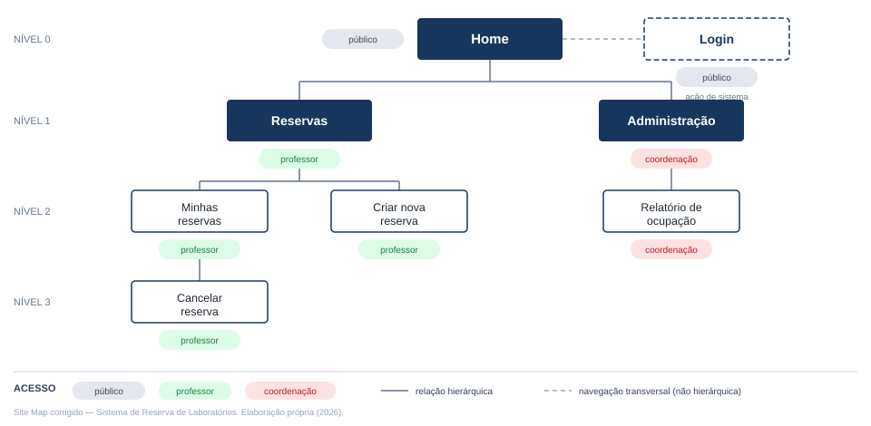

ATIVIDADE ES-03 — PROTOTIPAÇÃO, SITE MAP E IFML

Partes A e B — Revisão de artefatos do caso fictício "Sistema de Reserva de Laboratórios"

Aluno: Kauã da Silva Fernandes · Matrícula: 2025103070028
Curso: Análise e Desenvolvimento de Sistemas · Disciplina: Engenharia de Software
Professor: Gilberto Pereira da Silva · Semestre: 2026/2
Instituto Federal de Educação, Ciência e Tecnologia de Rondônia (IFRO) — Campus Vilhena
Vilhena/RO, 2026

Nota: este documento contém exclusivamente as Partes A e B da Atividade ES-03, referentes ao caso fictício "Sistema de Reserva de Laboratórios", comum a toda a turma. A Parte C, de produção no Figma a partir do projeto Rede de Apoio a Cuidadores de Idosos, não integra esta entrega parcial.

---

## 1 PARTE A — REVISÃO DO SITE MAP

### 1.1 Identificação dos problemas (A1)

Esta seção analisa o Site Map "proposto — Sistema de Reserva de Laboratórios", artefato entregue pela equipe fictícia para revisão, identificando seis problemas de arquitetura da informação. Para cada problema, indicam-se o nome, a localização exata na figura original, a justificativa técnica de por que a estrutura compromete o Site Map e a correção proposta. As seis correções são integralmente refletidas no Site Map corrigido apresentado na seção 1.2.

#### 1.1.1 Problema A1.1 — Ação de autenticação representada como área de navegação

**Localização:** nó "Fazer login", no Nível 1, posicionado como irmão hierárquico direto de "Reservas" e "Administração", subordinado a "Home".

**Por que é um problema:** um Site Map organiza páginas e áreas de conteúdo ou funcionalidade em uma hierarquia que comunica ao leitor a natureza e a abrangência de cada seção do sistema (ROSENFELD; MORVILLE; ARANGO, 2015). "Reservas" e "Administração" são áreas funcionais que agregam múltiplas páginas relacionadas a domínios distintos do sistema — reservar laboratórios e administrar relatórios, respectivamente —, ao passo que "Fazer login" é uma ação pontual de autenticação, sem conteúdo ou subpáginas próprias: no diagrama original, esse nó não possui nenhum filho. Ao posicionar "Fazer login" no mesmo nível hierárquico das duas áreas funcionais, o Site Map sugere, incorretamente, que o login tem a mesma natureza e abrangência de "Reservas" e "Administração", o que compromete a coerência semântica da hierarquia: o leitor não consegue distinguir, apenas pela posição no diagrama, quais nós representam áreas de conteúdo navegáveis e qual representa um portão de acesso transversal ao sistema.

**Correção proposta:** remover "Fazer login" da fileira de áreas funcionais de Nível 1 e representá-lo como uma ação de sistema, transversal e acessível a partir de "Home", separada estruturalmente do agrupamento de áreas de conteúdo.

#### 1.1.2 Problema A1.2 — Página órfã

**Localização:** nó "Cancelar reserva", no Nível 3, ao lado de "Relatório de ocupação" — sem linha de conexão a "Minhas reservas", "Reservas", "Relatórios" ou a qualquer outro nó do Site Map.

**Por que é um problema:** uma página órfã é aquela que aparece no diagrama sem vínculo hierárquico com nenhum nó superior, o que impede identificar sob qual área funcional ela se encontra, qual o seu perfil de acesso e por qual caminho de navegação um usuário chegaria até ela. No caso de "Cancelar reserva", essa desconexão é agravada pela ausência de qualquer marcação de acesso (público, professor ou coordenação) associada ao nó, rompendo a rastreabilidade entre páginas e perfis que o restante do Site Map mantém. Uma hierarquia com nós desconectados deixa de comunicar, de forma confiável, a arquitetura real do sistema.

**Correção proposta:** vincular "Cancelar reserva" como página filha de "Minhas reservas" — local em que um professor consultaria suas reservas ativas e, coerentemente, as cancelaria —, herdando o perfil de acesso "professor".

#### 1.1.3 Problema A1.3 — Etapa de formulário representada como página independente

**Localização:** nó "Escolher laboratório", no Nível 3, subordinado a "Criar nova reserva" (ramo Home → Reservas → Criar nova reserva → Escolher laboratório).

**Por que é um problema:** o wireframe "Criar nova reserva", revisado na Parte B deste documento, mostra que a escolha do laboratório (tabela "Laboratórios", com colunas Lab, Capacidade, Software instalado, Bloco e Selecionar) já ocorre na mesma tela em que são preenchidos os campos Data, Hora inicial, Hora final, Turma e Qtd. alunos, e a partir da qual se aciona "Salvar". Não há, no wireframe fornecido, nenhuma tela distinta dedicada exclusivamente à escolha do laboratório. Representar "Escolher laboratório" como página independente no Site Map, portanto, transforma um componente de formulário — uma tabela de seleção dentro de "Criar nova reserva" — em uma página hierárquica autônoma, misturando a representação do fluxo de preenchimento (sequência de interação dentro de uma única tela) com a representação da estrutura de navegação, que é o propósito de um Site Map (ROSENFELD; MORVILLE; ARANGO, 2015).

**Correção proposta:** eliminar o nó "Escolher laboratório" do Site Map; a seleção do laboratório passa a ser tratada como conteúdo da própria página "Criar nova reserva", sem gerar nível hierárquico adicional.

#### 1.1.4 Problema A1.4 — Nó raiz sem perfil de acesso definido

**Localização:** nó "Home", no Nível 0.

**Por que é um problema:** o próprio Site Map utiliza uma legenda de acesso (público, professor, coordenação) para classificar cada área quanto ao perfil que pode alcançá-la, mas essa classificação não é aplicada a "Home". Essa omissão gera ambiguidade: "Fazer login" — filho direto de Home — está marcado como público, o que sugere que Home é alcançável sem autenticação prévia; ao mesmo tempo, dois dos demais filhos de Home ("Reservas" e "Administração") exigem perfis restritos, sem que o diagrama esclareça se essa restrição já se aplica à própria Home ou apenas às áreas subordinadas a ela. Um Site Map que deixa o nó raiz sem classificação de acesso compromete justamente a informação que a legenda foi criada para comunicar de forma inequívoca.

**Correção proposta:** atribuir explicitamente o perfil de acesso "público" ao nó "Home", deixando claro que a página inicial é alcançável sem autenticação e que as restrições de perfil passam a valer a partir das áreas funcionais subordinadas.

#### 1.1.5 Problema A1.5 — Nível hierárquico sem função organizacional

**Localização:** ramo Home → Administração → Relatórios → Relatório de ocupação.

**Por que é um problema:** o nó "Relatórios" agrupa um único item filho, "Relatório de ocupação". Um nível de agrupamento se justifica quando organiza dois ou mais itens relacionados, diferenciando-os de outros conjuntos de conteúdo (ROSENFELD; MORVILLE; ARANGO, 2015); quando um nó intermediário possui exatamente um filho, ele acrescenta profundidade à hierarquia sem cumprir função organizacional alguma, pois não há, entre os relatórios do sistema apresentados no artefato, nenhuma outra opção da qual "Relatório de ocupação" precise ser diferenciado por meio desse agrupamento. Esse nível supérfluo obriga o usuário a navegar por uma camada adicional sem ganho de clareza e distancia desnecessariamente "Relatório de ocupação" de "Administração".

**Correção proposta:** eliminar o nó "Relatórios" e promover "Relatório de ocupação" a filho direto de "Administração", reduzindo a profundidade do ramo sem perda de conteúdo.

#### 1.1.6 Problema A1.6 — Duplicação de uma ação já prevista no wireframe correspondente

**Localização:** nó "Confirmar horário", no Nível 4, subordinado a "Escolher laboratório" (ramo Home → Reservas → Criar nova reserva → Escolher laboratório → Confirmar horário).

**Por que é um problema:** o wireframe "Criar nova reserva", analisado na Parte B, apresenta em sua própria tela a ação "Salvar" (âncora 5), responsável por persistir a reserva com os dados de data, horário, turma, quantidade de alunos e laboratório já preenchidos na mesma tela. O nó "Confirmar horário", ao ser representado como uma quarta página hierárquica, duplica essa mesma ação de confirmação/gravação já coberta pelo botão "Salvar", sem acrescentar funcionalidade distinta. Além de aprofundar desnecessariamente a hierarquia, essa duplicação cria duas representações concorrentes para a mesma ação de negócio — confirmar e salvar a reserva —, o que prejudica a consistência do Site Map.

**Correção proposta:** eliminar o nó "Confirmar horário"; a confirmação do horário passa a ser tratada pela ação "Salvar", já prevista na tela "Criar nova reserva".

### 1.2 Site Map corrigido (A2)

O Site Map corrigido a seguir aplica integralmente as seis correções descritas na seção 1.1: (i) "Fazer login" deixa de figurar como área de conteúdo de Nível 1 e passa a ser representado como ação de sistema, transversal e separada da hierarquia de áreas funcionais; (ii) "Cancelar reserva" passa a ser filha de "Minhas reservas", eliminando a página órfã; (iii) "Escolher laboratório" é eliminado como página independente, incorporando-se ao conteúdo da tela "Criar nova reserva"; (iv) "Home" recebe explicitamente o perfil de acesso público; (v) o nó "Relatórios" é eliminado, e "Relatório de ocupação" passa a ser filho direto de "Administração"; (vi) "Confirmar horário" é eliminado, por duplicar a ação "Salvar" já prevista no wireframe da mesma funcionalidade. O resultado preserva as funcionalidades legítimas do Sistema de Reserva de Laboratórios descritas no artefato original, com hierarquia coerente, profundidade reduzida — no máximo três níveis abaixo de Home — e perfis de acesso explícitos em todos os nós. Trata-se de um Site Map, e não de um fluxo de processo: nenhum clique, sequência temporal, mensagem, estado de erro ou etapa de aprovação foi representado como página.

FIGURA 1 — Site Map corrigido do Sistema de Reserva de Laboratórios



Fonte: elaboração própria (2026).

A representação hierárquica textual a seguir corresponde exatamente à estrutura apresentada na Figura 1 (arquivo `sitemap-corrigido.txt`):

```
Login [público] — ação de sistema (transversal, acessível a partir de Home;
                   não integra a hierarquia de áreas de conteúdo)

Home [público]
├── Reservas [professor]
│   ├── Minhas reservas [professor]
│   │   └── Cancelar reserva [professor]
│   └── Criar nova reserva [professor]
└── Administração [coordenação]
    └── Relatório de ocupação [coordenação]
```

---

## 2 PARTE B — REVISÃO DO WIREFRAME

### 2.1 Identificação dos problemas (B1)

Esta seção analisa o wireframe "Criar nova reserva", entregue pela mesma equipe fictícia, considerando hierarquia visual, ações, estados e conteúdo do formulário. As âncoras numeradas (1 a 5) citadas correspondem exatamente às indicadas na figura original.

#### 2.1.1 Problema B1.1 — Ausência de hierarquia visual entre as ações do rodapé

**Âncora/região:** marcador 5 — grupo de ações "Salvar", "Cancelar", "Limpar tudo", "Voltar" e "Exportar em PDF".

**Elemento afetado:** os cinco botões de ação da parte inferior do formulário.

**Problema identificado:** os cinco botões são apresentados com o mesmo estilo visual — mesma cor de preenchimento, mesmo contorno, mesmo tamanho —, sem diferenciação entre a ação primária do formulário ("Salvar") e as ações secundárias ou potencialmente destrutivas ("Cancelar", "Limpar tudo", "Voltar").

**Justificativa técnica:** Krug (2014) argumenta que uma interface eficaz deve tornar óbvia, sem exigir reflexão deliberada do usuário, qual é a ação esperada em cada tela; a ausência de hierarquia visual entre "Salvar" e as demais ações obriga o usuário a interpretar, campo a campo, qual botão conclui a tarefa principal. O problema é agravado pela proximidade entre "Salvar" e "Limpar tudo" — capaz de descartar todo o preenchimento do formulário —, apresentados com o mesmo peso visual, o que caracteriza uma falha do princípio heurístico de prevenção de erros descrito por Nielsen (1994): ações potencialmente destrutivas devem ser visualmente destacadas das ações de confirmação, e não equiparadas a elas.

**Correção proposta:** destacar "Salvar" como ação primária, com preenchimento sólido em cor de destaque; tratar "Cancelar" e "Voltar" como ações secundárias, em estilo contornado ou textual; e isolar "Limpar tudo" com estilo de alerta, afastando-a do agrupamento principal de confirmação.

#### 2.1.2 Problema B1.2 — Campos sem indicação de formato ou obrigatoriedade

**Âncora/região:** marcador 2 — campos "Data", "Hora inicial", "Hora final", "Turma" e "Qtd. alunos".

**Elemento afetado:** os cinco campos de entrada da primeira linha do formulário.

**Problema identificado:** nenhum dos cinco campos apresenta indicação de formato esperado (por exemplo, o padrão de data ou de hora), de tipo de controle adequado (texto livre, seletor, campo numérico) ou de obrigatoriedade de preenchimento.

**Justificativa técnica:** o controle de formulário deve comunicar ao usuário, antes do envio, o formato e as restrições esperadas para cada campo; sem essa informação, aumenta a probabilidade de o usuário preencher "Data" e "Hora inicial"/"Hora final" em formatos inconsistentes entre si, ou de deixar campos obrigatórios em branco — o que só seria percebido, se percebido, após a tentativa de salvar. Trata-se de uma falha de prevenção de erro na entrada de dados (NIELSEN, 1994).

**Correção proposta:** adicionar indicação de formato em cada campo (por exemplo, "dd/mm/aaaa" em Data e "hh:mm" em Hora inicial/Hora final), sinalizar campos obrigatórios com marcador visual e transformar "Turma" em campo de seleção (lista suspensa) em vez de texto livre, reduzindo a possibilidade de erro de digitação.

#### 2.1.3 Problema B1.3 — Controle de seleção ambíguo quanto à quantidade de laboratórios

**Âncora/região:** marcador 4 — tabela "Laboratórios", coluna "Selecionar".

**Elemento afetado:** as caixas de seleção (checkbox) associadas a cada linha da tabela de laboratórios (LAB-01, LAB-02, LAB-03).

**Problema identificado:** a coluna "Selecionar" utiliza caixas de seleção múltipla (checkbox) para escolher o laboratório da reserva, embora o formulário possua apenas um conjunto de campos de data e horário — o que sugere que cada reserva se refere a um único laboratório, em um único intervalo de tempo.

**Justificativa técnica:** o tipo de controle de seleção comunica ao usuário a cardinalidade esperada da escolha: caixas de seleção indicam, por convenção de interface, que mais de uma opção pode ser marcada simultaneamente. Se o objetivo é reservar um único laboratório por vez — o que é sugerido pela existência de apenas um par de campos "Hora inicial"/"Hora final" no mesmo formulário —, o uso de checkbox cria ambiguidade sobre o que ocorreria caso mais de um laboratório fosse marcado, violando a correspondência entre o comportamento do sistema e a expectativa do usuário (NIELSEN, 1994). Registra-se a ambiguidade: caso a intenção real seja permitir múltiplos laboratórios em uma mesma reserva, essa regra não está comunicada no wireframe fornecido.

**Correção proposta:** substituir as caixas de seleção por botões de rádio (seleção única) na coluna "Selecionar", garantindo que apenas um laboratório seja escolhido por reserva; caso a multisseleção seja de fato desejada, essa regra deve ser explicitada por meio de texto de apoio junto à tabela.

#### 2.1.4 Problema B1.4 — Ausência de agrupamento entre campos de naturezas distintas

**Âncora/região:** marcador 2 — campos "Data", "Hora inicial", "Hora final", "Turma" e "Qtd. alunos".

**Elemento afetado:** disposição da primeira linha de campos do formulário.

**Problema identificado:** os cinco campos são apresentados lado a lado, com o mesmo espaçamento e sem separação visual, embora pertençam a naturezas distintas: "Data", "Hora inicial" e "Hora final" descrevem quando a reserva ocorre, enquanto "Turma" e "Qtd. alunos" descrevem quem a utilizará.

**Justificativa técnica:** o agrupamento por proximidade e relação semântica entre campos permite que o usuário reconheça rapidamente a estrutura lógica de um formulário extenso, reduzindo o tempo de leitura e o esforço de interpretação; a ausência desse agrupamento obriga o usuário a ler individualmente cada rótulo para reconstruir mentalmente essas duas categorias, aumentando a densidade percebida do formulário (GARRETT, 2011).

**Correção proposta:** reorganizar os campos em subgrupos visuais — "Data e horário" (Data, Hora inicial, Hora final) e "Turma e participantes" (Turma, Qtd. alunos) —, com espaçamento ou subtítulos que evidenciem essa relação.

#### 2.1.5 Problema B1.5 — Ação de exportação presente antes da existência de um registro salvo

**Âncora/região:** marcador 5 — botão "Exportar em PDF".

**Elemento afetado:** ação "Exportar em PDF", no grupo de botões inferiores.

**Problema identificado:** o botão "Exportar em PDF" está disponível na própria tela de criação de uma reserva ainda não salva, sem que fique claro o que exatamente seria exportado nesse momento.

**Justificativa técnica:** a clareza de uma ação depende de o usuário conseguir prever seu resultado antes de acioná-la. Como a reserva ainda não foi persistida durante o preenchimento do formulário, não existe, até esse ponto, um registro confirmado que justifique uma exportação em PDF — ação tipicamente associada a um comprovante de algo já concluído. A presença dessa ação na tela de criação sugere posicionamento inconsistente com o restante do fluxo, misturando uma ação típica de tela de consulta/detalhe com uma tela de cadastro.

**Correção proposta:** remover "Exportar em PDF" da tela "Criar nova reserva" e reposicioná-la na tela em que a reserva já exista como registro confirmado — por exemplo, em "Minhas reservas", após o salvamento —, onde exportar um comprovante da reserva é uma ação com resultado previsível.

### 2.2 Estados adicionais (B2)

O wireframe fornecido apresenta apenas o estado inicial, em branco, da tela "Criar nova reserva", conforme indicado em sua própria legenda: "Não há nenhuma outra tela ou estado especificado para esta funcionalidade". A seguir, propõem-se três estados adicionais necessários à funcionalidade de criação de uma reserva de laboratório.

#### 2.2.1 Estado 1 — Conflito de horário / indisponibilidade do laboratório

**Condição que o provoca:** o usuário seleciona um laboratório (coluna "Selecionar" da tabela "Laboratórios") em um intervalo de "Data", "Hora inicial" e "Hora final" que já possui reserva confirmada para o mesmo laboratório, e aciona "Salvar".

**Comportamento esperado da interface:** a tela permanece no formulário preenchido, destaca a linha do laboratório em conflito na tabela "Laboratórios" e exibe uma mensagem específica junto a ela (por exemplo, "LAB-02 já está reservado para o horário informado"), impedindo o envio até que o usuário altere o horário ou escolha outro laboratório.

**Por que esse estado é necessário:** sem ele, dois professores poderiam reservar o mesmo laboratório para o mesmo horário, comprometendo a regra de negócio central de um sistema de reserva.

#### 2.2.2 Estado 2 — Validação de campos obrigatórios e de capacidade excedida

**Condição que o provoca:** o usuário aciona "Salvar" com campos obrigatórios em branco (por exemplo, "Data" ou "Turma") ou informa uma "Qtd. alunos" maior que a capacidade do laboratório selecionado na tabela "Laboratórios" (LAB-01: 30; LAB-02: 24; LAB-03: 20).

**Comportamento esperado da interface:** a tela mantém o usuário no formulário, destaca em vermelho os campos inválidos, exibe uma mensagem específica junto a cada campo (por exemplo, "Qtd. de alunos (35) excede a capacidade do LAB-03 (20)") e mantém "Salvar" indisponível até a correção dos valores.

**Por que esse estado é necessário:** o wireframe fornecido não define nenhuma restrição de preenchimento visível para os campos do formulário; sem esse estado, seria possível persistir uma reserva com dados inconsistentes com a capacidade real do laboratório escolhido.

#### 2.2.3 Estado 3 — Falha de sistema ao salvar a reserva

**Condição que o provoca:** o usuário preenche o formulário corretamente, sem conflitos de horário nem violações de capacidade, e aciona "Salvar", mas a requisição ao servidor falha antes de uma resposta de sucesso ou de conflito ser recebida (por exemplo, perda de conexão ou indisponibilidade temporária do serviço).

**Comportamento esperado da interface:** a tela mantém todos os dados já preenchidos pelo usuário, exibe uma mensagem de erro de sistema (por exemplo, "Não foi possível salvar a reserva. Tente novamente.") e reabilita a ação "Salvar" para uma nova tentativa.

**Por que esse estado é necessário:** sem ele, uma falha de comunicação levaria o usuário a perder os dados já preenchidos ou a permanecer sem qualquer retorno sobre o que ocorreu, violando a visibilidade do status do sistema (NIELSEN, 1994).

### 2.3 Cenário de exceção (Gherkin)

Cada um dos três estados propostos na seção 2.2 é relacionado, a seguir, a um cenário de exceção plausível, descrito no formato Gherkin, conforme solicitado no enunciado e nos critérios de correção de B2.

**Cenário relacionado ao Estado 1 — Conflito de horário**

```gherkin
# language: pt-br
Funcionalidade: Criação de reserva de laboratório

  Cenário: Tentativa de reserva em horário já ocupado
    Dado que o professor está autenticado na área "Reservas"
    E o laboratório "LAB-02" já possui uma reserva confirmada das 14h às 16h no dia 10/11/2026
    Quando o professor preenche o formulário "Criar nova reserva" selecionando o laboratório "LAB-02" no mesmo dia, das 15h às 17h
    E aciona a ação "Salvar"
    Então o sistema exibe a mensagem "LAB-02 já está reservado para o horário informado"
    E a reserva não é criada
    E o laboratório "LAB-02" permanece destacado até que o professor escolha outro horário ou laboratório
```

**Cenário relacionado ao Estado 2 — Validação de capacidade excedida**

```gherkin
# language: pt-br
Funcionalidade: Criação de reserva de laboratório

  Cenário: Quantidade de alunos excede a capacidade do laboratório
    Dado que o professor está preenchendo o formulário "Criar nova reserva"
    E o laboratório "LAB-03" possui capacidade máxima de 20 alunos
    Quando o professor informa "35" no campo "Qtd. alunos" e seleciona o laboratório "LAB-03"
    E aciona a ação "Salvar"
    Então o sistema exibe a mensagem "Qtd. de alunos (35) excede a capacidade do LAB-03 (20)" junto ao campo "Qtd. alunos"
    E a ação "Salvar" permanece indisponível até a correção do valor
```

**Cenário relacionado ao Estado 3 — Falha de sistema ao salvar**

```gherkin
# language: pt-br
Funcionalidade: Criação de reserva de laboratório

  Cenário: Falha de comunicação ao salvar a reserva
    Dado que o professor preencheu corretamente o formulário "Criar nova reserva"
    E selecionou um laboratório disponível no horário informado
    Quando o professor aciona a ação "Salvar"
    E ocorre uma falha de comunicação com o servidor
    Então o sistema exibe a mensagem "Não foi possível salvar a reserva. Tente novamente."
    E os dados preenchidos pelo professor permanecem no formulário
    E a ação "Salvar" é reabilitada para uma nova tentativa
```

---

## REFERÊNCIAS

GARRETT, Jesse James. **The elements of user experience**: user-centered design for the Web and beyond. 2. ed. Berkeley: New Riders, 2011.

KRUG, Steve. **Don't make me think, revisited**: a common sense approach to Web usability. 3. ed. Berkeley: New Riders, 2014.

NIELSEN, Jakob. **10 usability heuristics for user interface design**. [S. l.]: Nielsen Norman Group, 1994. Disponível em: https://www.nngroup.com/articles/ten-usability-heuristics/. Acesso em: 16 set. 2026.

ROSENFELD, Louis; MORVILLE, Peter; ARANGO, Jorge. **Information architecture**: for the Web and beyond. 4. ed. Sebastopol: O'Reilly Media, 2015.
