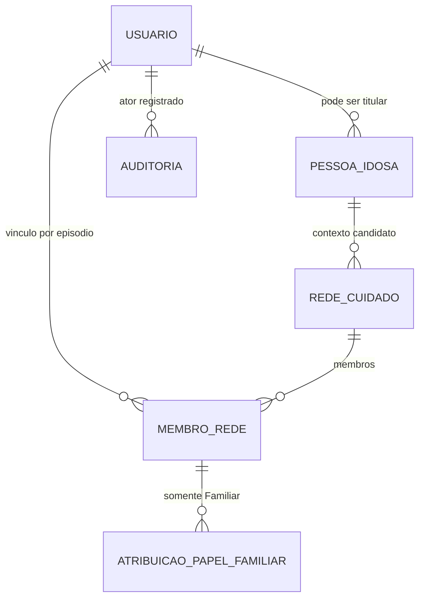
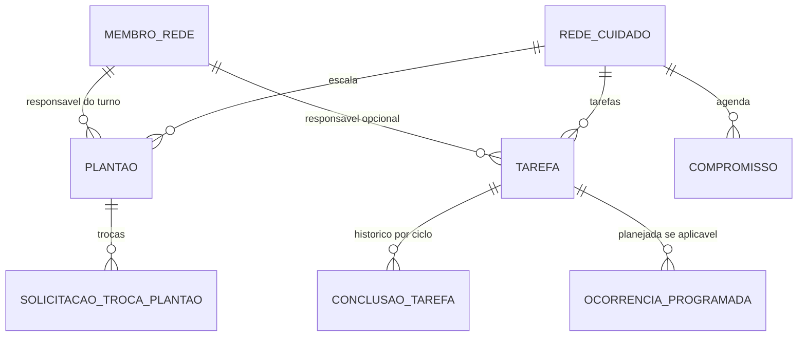
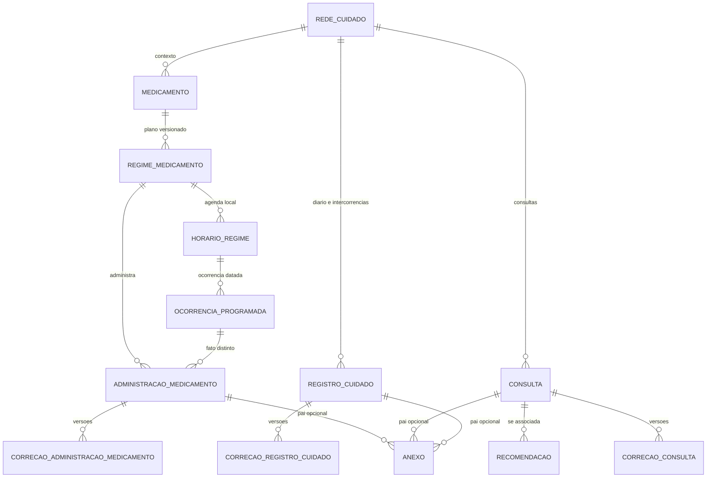
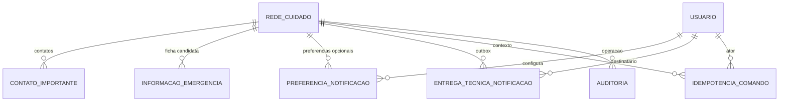

# Mapa visual de relações — MySQL V0.1

**Fonte de relações:** `database/mysql/001_rede_de_apoio_schema.sql`; o arquivo SQL é a referência física **experimental**, e estes diagramas são **projeções simplificadas para documentação**, não outra fonte para gerar migrations. O diagrama MySQL Workbench EER definitivo deve ser obtido por importação/reverse engineering do próprio SQL.

**Atenção:** marcadores de cardinalidade abaixo indicam **direção de navegação habitual** entre pais e filhos. Não homologam a quantidade mínima de linhas, a política A1/A2/B de `pessoa_idosa ↔ rede_cuidado`, nem obrigatoriedade de registros opcionais. Use PK/FK/NULL efetivos do SQL e ADRs pendentes para semântica física.

## 1. Identidade, rede e papéis

A FK de categoria impede papel Familiar em Profissional, e o usuário do tipo Pessoa Idosa não entra como membro. UNIQUE gerada limita no máximo um Principal não revogado por rede; **não garante presença** de Principal e Profissional em toda rede operacional.

## 2. Agenda, plantões, trocas e tarefas

**DEC-S01:** dois plantões diferentes com intervalos coincidentes são válidos. **DEC-S03:** uma única conclusão por (tarefa,ciclo), via UNIQUE e transação/versionamento. **DB-006/007:** permuta e reabertura continuam pendentes, apesar de existir estrutura candidata.

## 3. Medicamentos, registros e versões

Os anexos possuem **exatamente uma** FK de pai preenchida entre Diário, Consulta e Administração, não três ao mesmo tempo. **DEC-S02:** ocorrência programada e administração são fatos distintos. N04 é *ausência de registro no sistema*, não comprovação de omissão clínica. **Não** foi homologada unicidade clínica de administração por ocorrência.

## 4. Contatos, informações, notificações e rastreabilidade

Outbox é **infraestrutura técnica**, não Central de Notificações. N01–N04 usam feedback transitório. O destinatário do N02 com dois ou mais Plantonistas Atuais continua **DB-030 pendente**. Preferências não podem desligar notificações obrigatórias.

## Workbench: diagrama de referência física

1. Baixar [001_rede_de_apoio_schema.sql](001_rede_de_apoio_schema.sql).
2. **File → Import → Reverse Engineer MySQL Create Script** e selecionar a opção de inserir objetos em EER. Alternativamente executar localmente em instância descartável e usar **Database → Reverse Engineer**.
3. Conferir **28 tabelas** e linhas de FK entre redes, membro, plantão, tarefa, medicamento, correções e anexos.
4. Salvar arquivo `.mwb`, reorganizar manualmente por grupos e exportar imagem quando necessário.
5. Registrar eventuais erros reais do Workbench/MySQL em Issue/PR; não afirmar que só a validação estática prova a importação.

Os diagramas Mermaid aqui são referências para orientação rápida **GitHub-only**; o modelo EER físico só é provado quando importado na ferramenta.
