# Capturas canônicas do Figma no GitHub — base de implementação

**Data da captura:** 2026-10-09. **Origem:** página `Fluxo Final` (`5926:1014`) do arquivo Figma `tcyj2fkTXei2CJbqaRxqCp`. Exportação direta dos frames canônicos; cada PNG é um **snapshot estático**, não informação funcional nova nem substituição permanente do design system.

Os arquivos binários PNG ficam em `assets/` e seu inventário legível por máquina está em [SCREENSHOTS_INDEX.json](SCREENSHOTS_INDEX.json). Todos os links de imagem abaixo são **relativos ao repositório**. Assim, um Codex com acesso só ao GitHub pode ver as referências sem autenticação Figma.

## T01–T17: baseline de cada tela

| | | |
|---|---|---|
| 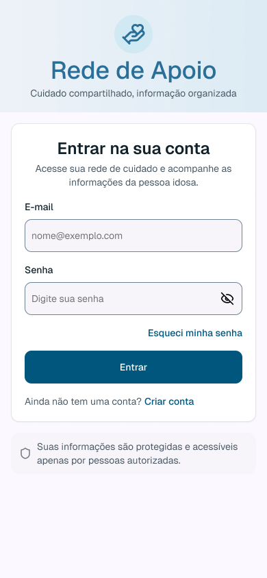 | 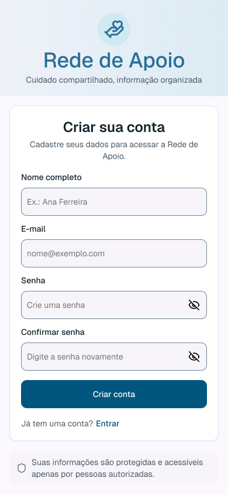 | 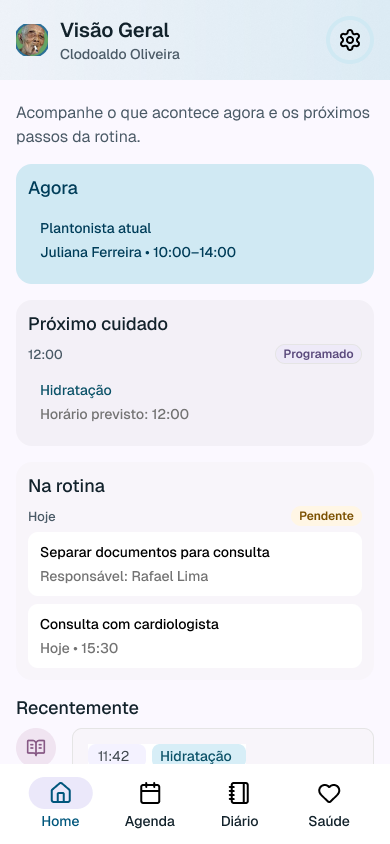 |
| 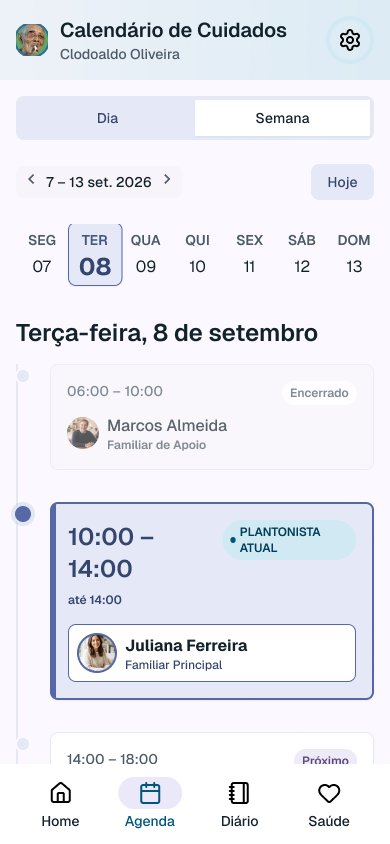 | 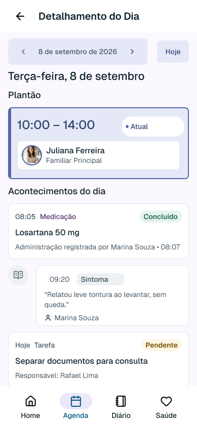 |  |
| 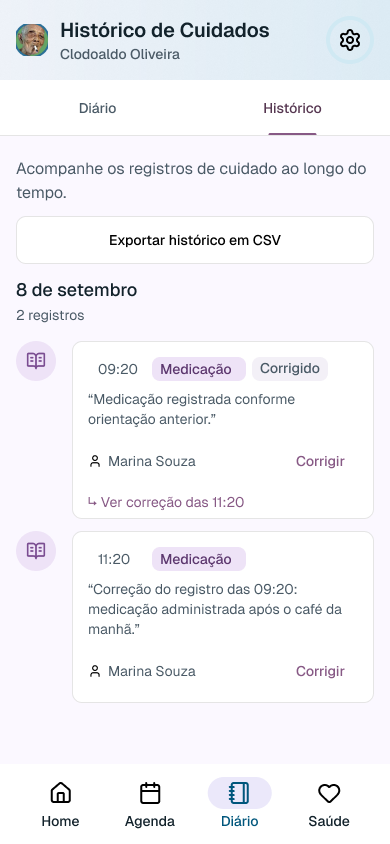 | 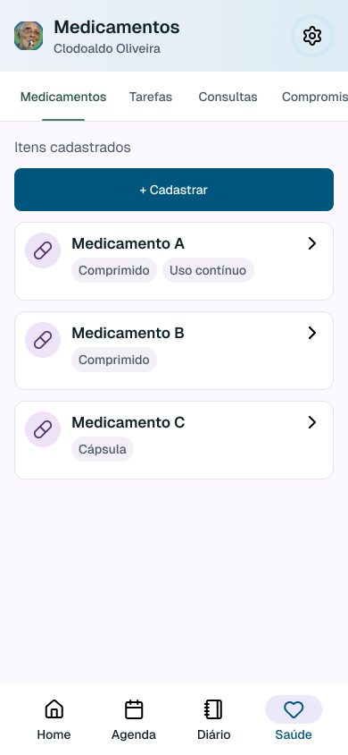 | 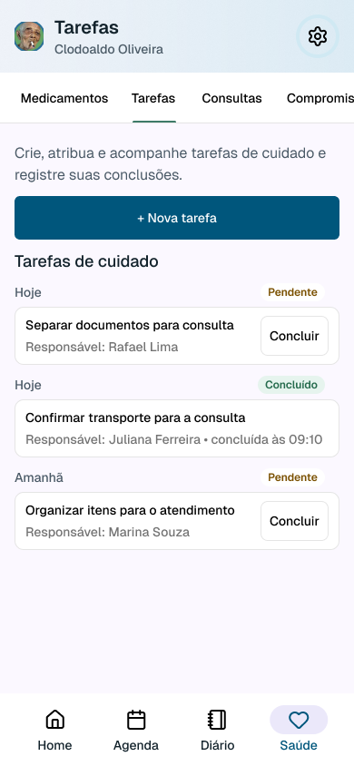 |
| 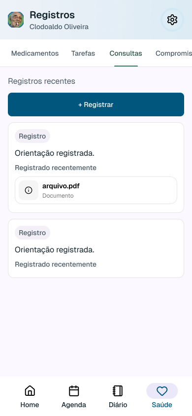 | 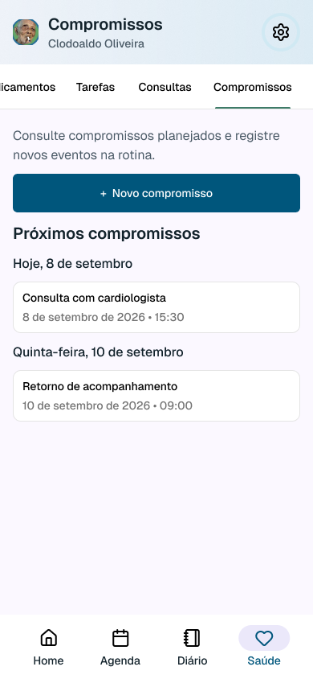 | 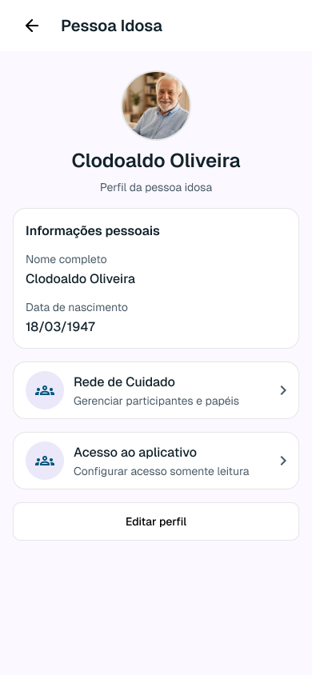 |
| 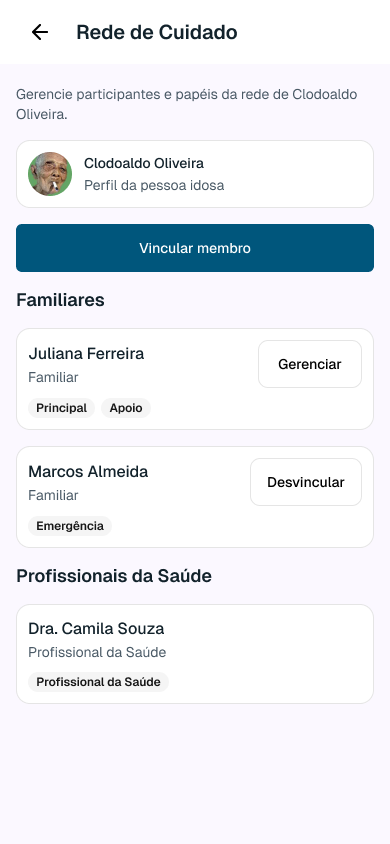 | 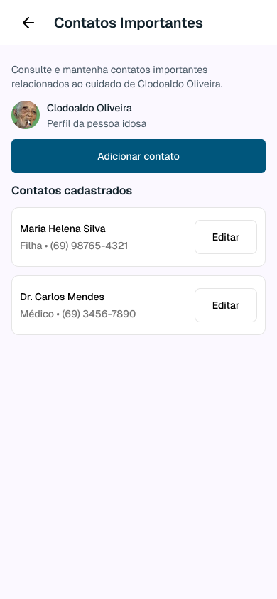 | 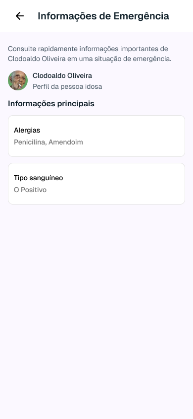 |
| 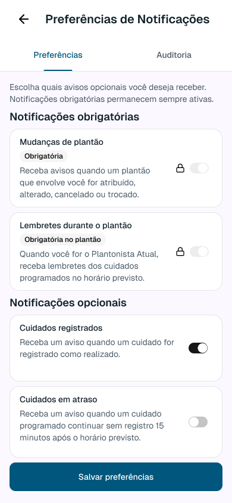 | 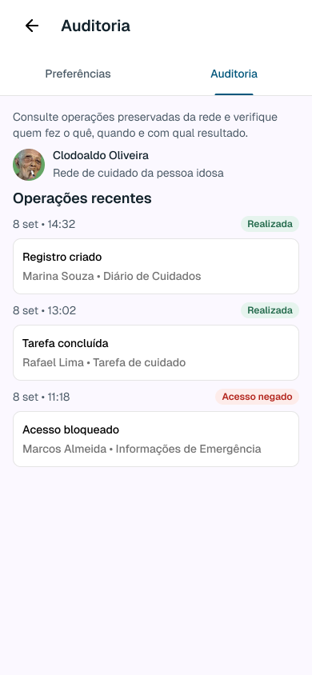 |

## Estados adicionais de maior impacto

**T06-NOVO-REGISTRO — Novo registro em Bottom Sheet** (origem `5977:7182`)

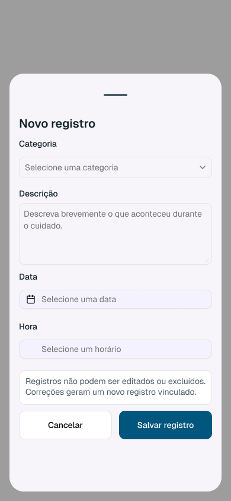

**T08-CADASTRAR-MEDICAMENTO — Cadastrar medicamento em Bottom Sheet** (origem `5967:6307`)

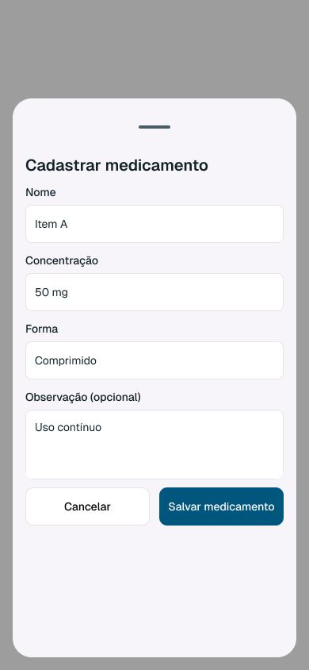

**T09-NOVA-TAREFA — Nova tarefa em Bottom Sheet** (origem `5974:6252`)

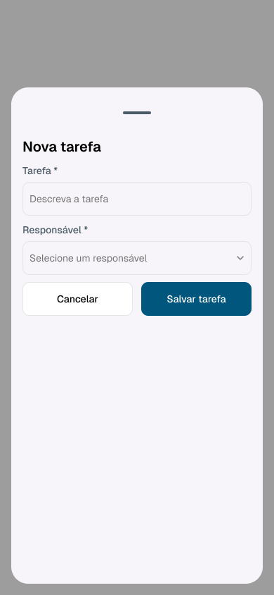

**T10-NOVO-REGISTRO — Nova consulta em Bottom Sheet** (origem `5974:35902`)

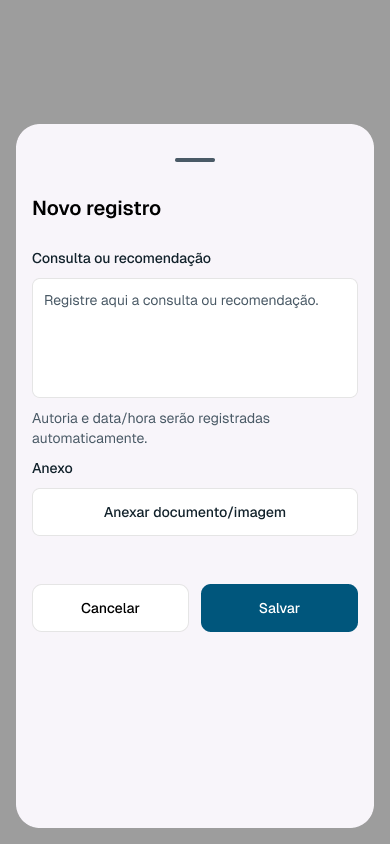

**T11-NOVO-COMPROMISSO — Novo compromisso em Bottom Sheet** (origem `5974:36062`)

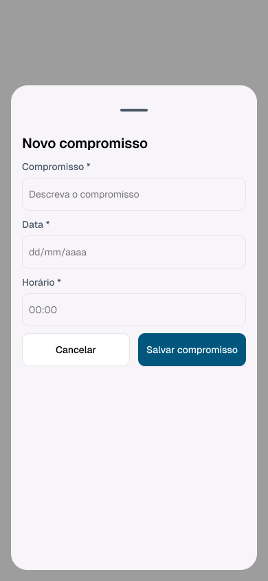

**T03-PESSOA-IDOSA — Home da Pessoa Idosa (somente leitura)** (origem `5948:5317`)

**T13-PESSOA-IDOSA — Rede de Cuidado da Pessoa Idosa (somente leitura)** (origem `5948:6516`)

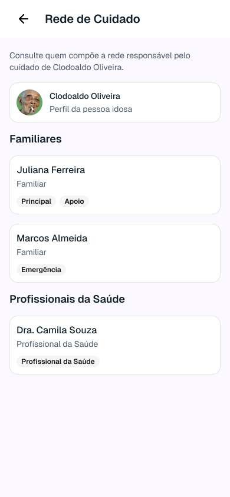

**T01-CREDENCIAIS-INVALIDAS — Credenciais inválidas** (origem `5926:32076`)

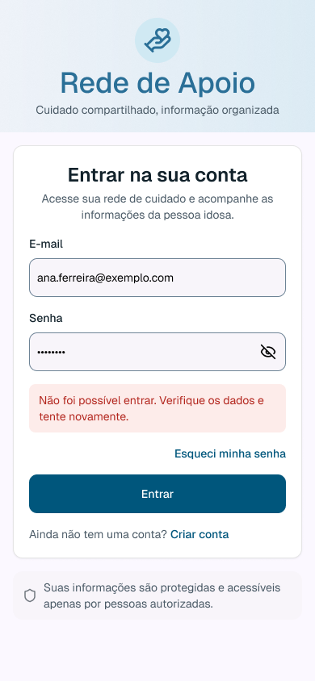

**T17-ACESSO-NEGADO — Acesso negado à auditoria** (origem `5926:37017`)

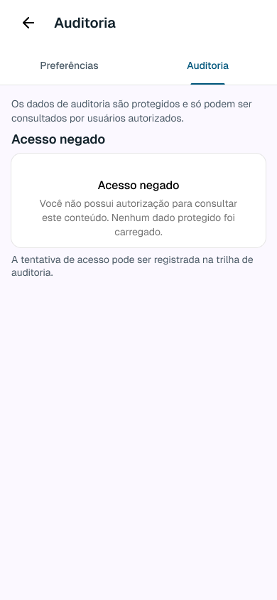

## Como implementar sem Figma

1. Consultar o comportamento aprovado em `docs/01_REQUIREMENTS/` e `docs/02_BUSINESS_RULES/`. As imagens **não autorizam** novas funcionalidades.
2. Consultar `docs/07_AI_CONTEXT/SCREEN_REGISTRY.yaml`, `STATE_MATRIX.yaml`, `docs/04_DESIGN_SYSTEM/` e `docs/05_FIGMA/FIGMA_REGISTRY.yaml`.
3. Tomar o PNG `T##.png` como referência de composição visual para resolução de **390×844 px**; os demais estados devem respeitar `PAGE BASE + DELTA MÍNIMO`.
4. Para T06/T08/T09/T10/T11, os cinco overlays acima são os estados **canônicos Bottom Sheet**. Os estados antigos de formulário em tela inteira estão superados.
5. Para Pessoa Idosa, aplicar `ELDERLY_READ_ONLY_FLOW.yaml`: T03–T15 só leitura; sem escrita, administração, exportação, T16 ou T17. Os dois PNGs extras exemplificam, **não representam todas as 13 telas read-only**.
6. Implementar espaço/cores/tipografia/tokens com os documentos versionados; o PNG não mede sozinho propriedades exatas como radius, elevation ou reação de navegação.
7. Validar responsividade, scroll clipping, touch target **≥48×48 px**, filtros de permissão no servidor e snapshots de UI. Se houver ambiguidade, consultar fonte escrita; não inferir requisitos por pixels.

**Limitações transparentes:** este pacote preserva **17 frames-base + 9 estados escolhidos**. Não captura todas as variações da matriz, todas as transições/interações, assets vetoriais, bibliotecas pagas ou a árvore editável do Figma. Os registries YAML completos continuam no GitHub, e alterações visuais futuras precisam atualização deliberada do snapshot com novo commit.

Referência remota opcional de origem: https://www.figma.com/design/tcyj2fkTXei2CJbqaRxqCp/?node-id=5926-1014 — **não é dependência obrigatória** para ler este catálogo.
